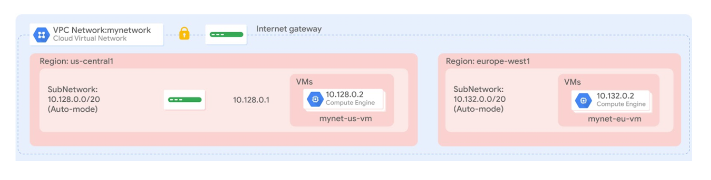

# Automating-the-Deployment-of-Infrastructure-Using-Terraform
Google Cloud

### Overview
Terraform enables you to safely and predictably create, change, and improve infrastructure. It is an open-source tool that codifies APIs into declarative configuration files that can be shared among team members, treated as code, edited, reviewed, and versioned.

In this lab, you create a Terraform configuration with a module to automate the deployment of Google Cloud infrastructure. Specifically, you deploy one auto mode network with a firewall rule and two VM instances, as shown in this diagram:

## Task-1: Set up Terraform and Cloud Shell
1. Install Terraform:
   
Terraform is now integrated into Cloud Shell. Verify which version is installed.
  1. In the Cloud Console, click Activate Cloud Shell (Activate Cloud Shell icon).
  2. If prompted, click Continue.
  3. To confirm that Terraform is installed, run the following command:```terraform --version```
2. To create a directory for your Terraform configuration, run the following command: ```mkdir tf-infra```

### Initialize Terraform
1. Create a new file inside tf-infra directory:
```
vi provider.tf
```
Copy the code into provider.tf:
```
provider "google" {}
```
2. To initialize Terraform, run the following command:
```
cd tfinfra
terraform init
```
### Task-2: Create mynetwork and its resources
Creating the auto mode network mynetwork along with its firewall rule and two VM instances (mynet_us_vm and mynet_eu_vm).
1. Configure mynetwork: ```vi mynetwork.tf``` 
```
# Create the mynetwork network
resource "google_compute_network" "mynetwork" {
name = "mynetwork"
# RESOURCE properties go here
auto_create_subnetworks = "true"
}
```
2. Configure the firewall rule: Define a firewall rule to allow HTTP, SSH, RDP, and ICMP traffic on mynetwork.
   1. Add the following base code to mynetwork.tf:
    ```
    # Add a firewall rule to allow HTTP, SSH, RDP and ICMP traffic on mynetwork
    resource "google_compute_firewall" "mynetwork-allow-http-ssh-rdp-icmp" {
    name = "mynetwork-allow-http-ssh-rdp-icmp"
    # RESOURCE properties go here
    network = google_compute_network.mynetwork.self_link
    allow {
        protocol = "tcp"
        ports    = ["22", "80", "3389"]
        }
    allow {
        protocol = "icmp"
        }
    source_ranges = ["0.0.0.0/0"]
    }
    ```
3. Verify that your mynetwork.tf file look like this:
```
# Create the mynetwork network
resource "google_compute_network" "mynetwork" {
name = "mynetwork"
# RESOURCE properties go here
auto_create_subnetworks = "true"
}
# Add a firewall rule to allow HTTP, SSH, RDP and ICMP traffic on mynetwork
resource "google_compute_firewall" "mynetwork-allow-http-ssh-rdp-icmp" {
name = "mynetwork-allow-http-ssh-rdp-icmp"
# RESOURCE properties go here
network = google_compute_network.mynetwork.self_link
allow {
    protocol = "tcp"
    ports    = ["22", "80", "3389"]
    }
allow {
    protocol = "icmp"
    }
source_ranges = ["0.0.0.0/0"]
}
```
4. Configure the VM instance: ```vi main.tf```
```
resource "google_compute_instance" "vm_instance" {
  name         = "${var.instance_name}"
  zone         = "${var.instance_zone}"
  machine_type = "${var.instance_type}"
  boot_disk {
    initialize_params {
      image = "debian-cloud/debian-11"
      }
  }
  network_interface {
    network = "${var.instance_network}"
    access_config {
      # Allocate a one-to-one NAT IP to the instance
    }
  }
}
```
5. Define the 4 input variables in variables.tf:
```
variable "instance_name" {}
variable "instance_zone" {}
variable "instance_type" {
  default = "e2-micro"
  }
variable "instance_network" {}
```
6. Add the following VM instances to mynetwork.tf:
```
# Create the mynet-us-vm instance
module "mynet-us-vm" {
  source           = "./instance"
  instance_name    = "mynet-us-vm"
  instance_zone    = "Zone"
  instance_network = google_compute_network.mynetwork.self_link
}

# Create the mynet-eu-vm" instance
module "mynet-eu-vm" {
  source           = "./instance"
  instance_name    = "mynet-eu-vm"
  instance_zone    = "Zone 2"
  instance_network = google_compute_network.mynetwork.self_link
}
```
7. Verify that mynetwork.tf looks like this, including brackets {}
```
# Create the mynetwork network
resource "google_compute_network" "mynetwork" {
name = "mynetwork"
# RESOURCE properties go here
auto_create_subnetworks = "true"
}
# Add a firewall rule to allow HTTP, SSH, RDP and ICMP traffic on mynetwork
resource "google_compute_firewall" "mynetwork-allow-http-ssh-rdp-icmp" {
name = "mynetwork-allow-http-ssh-rdp-icmp"
# RESOURCE properties go here
network = google_compute_network.mynetwork.self_link
allow {
    protocol = "tcp"
    ports    = ["22", "80", "3389"]
    }
allow {
    protocol = "icmp"
    }
source_ranges = ["0.0.0.0/0"]
}
# Create the mynet-us-vm instance
module "mynet-us-vm" {
  source           = "./instance"
  instance_name    = "mynet-us-vm"
  instance_zone    = "Zone"
  instance_network = google_compute_network.mynetwork.self_link
}
# Create the mynet-eu-vm" instance
module "mynet-eu-vm" {
  source           = "./instance"
  instance_name    = "mynet-eu-vm"
  instance_zone    = "Zone 2"
  instance_network = google_compute_network.mynetwork.self_link
}
```
8. To rewrite the Terraform configuration files to a canonical format and style, run the following command: ```terraform fmt```
9. To initialize Terraform, run the following command: ```terraform init```
10. To create an execution plan, run the following command: ```terraform plan```
11. To apply the desired changes, run the following command: ```terraform apply```
12. To terminate/destory all the resources managed by Terraform project, run the following command: ```terraform destory```
